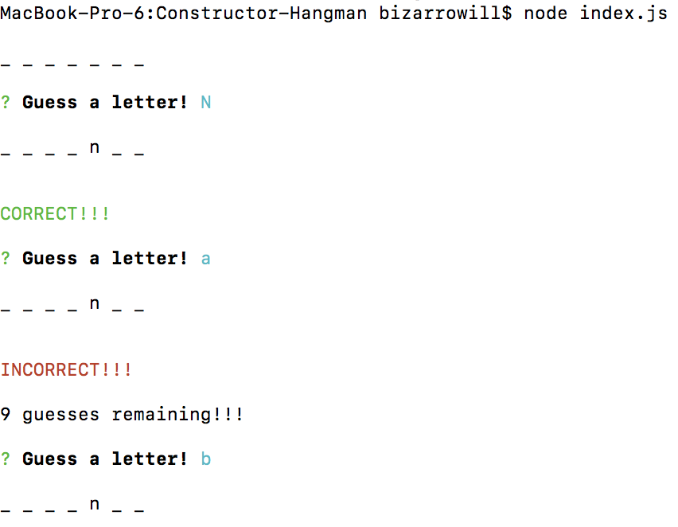
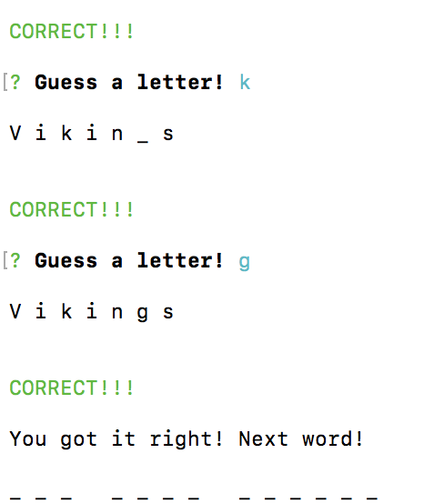
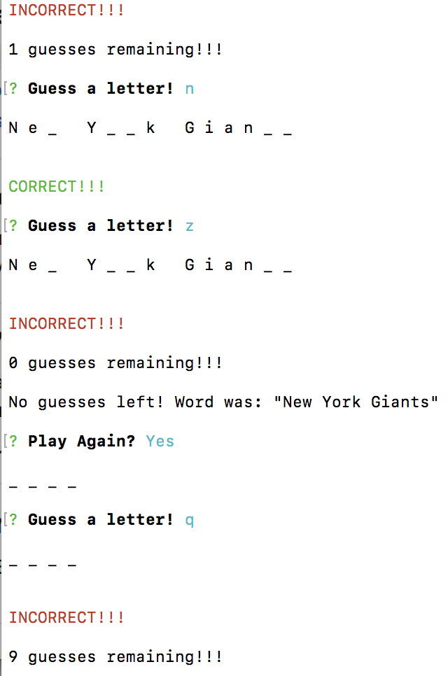

# Constructor-Hangman
  -a hangman command-line game using constructor functions

*Instructions*

1. The completed game receives user input using the inquirer and prompt npm packages.
2. The app utilizes the multiple Constructors and Prototypes to build the game:

*Word* Used to create an object representing the current word the user is attempting to guess. This contains word specific logic and data.

*Letter* Used for each letter in the current word. Each letter object will display either an underlying character, or a blank placeholder (such as an underscore), depending on whether or not the user has guessed the letter. This contains letter specific logic and data.

Game in action:

#starting game

#winning game

#losing game
